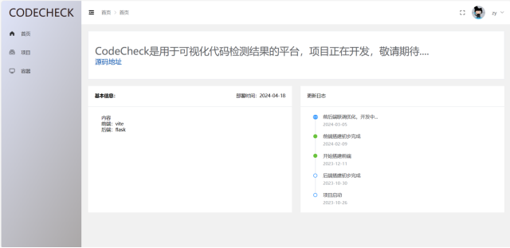
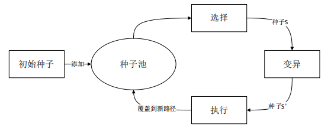
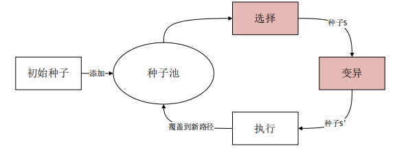
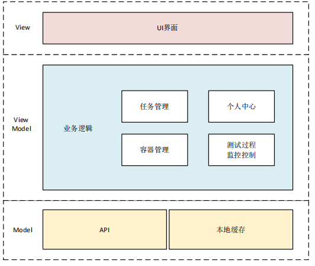
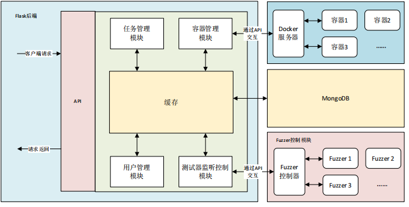
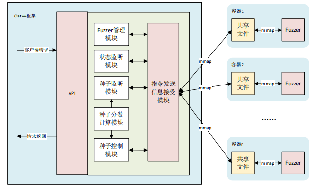
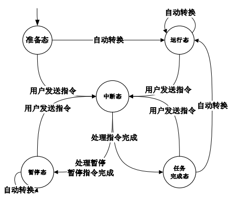
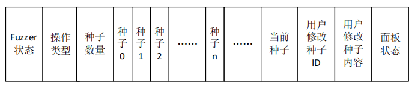

# HumanFuzz

HumanFuzz是一个fuzz软件，基于AFL开发，提供了易操作的前端界面，能够**实时监控fuzz过程，控制当前正在fuzz的种子**，从而实现对fuzzer的控制。

传统的动态模糊测试工具在运行过程中，其中间过程和状态信息等往往处于隐藏状态，用户难以实时获取这些信息，这无疑限制了用户对测试过程的深入了解和优化。

HumanFuzz主要创新点如下：

- **展示Fuzz过程**：提供了web界面，能够直观地展示种子池中的种子信息，当前正在fuzz的种子等动态模糊测试的行为，从而更快地学习了解动态模糊测试的过程

- **控制Fuzzer行为**：提供了web界面，能够选择Fuzzer要fuzz的种子，从而方便地控制Fuzzer的行为

- **封装良好**：提供了测试容器的分配和回收，让测试人员无需自行配置测试环境，能够通过web界面进行相关测试任务

# 界面展示

## 主界面

## 项目管理界面

## 容器管理界面

## 容器控制面板

## 模糊测试控制面板

# 背景介绍

## 动态模糊测试

动态模糊测试技术（Dynamic Fuzzing）是一种软件测试技术。整体流程如图所示，开始时初始种子被加入到种子池中，然后从种子池中通过算法挑选出最合适的种子S，接着使用多种编译策略得到变异后的种子S'，S‘会被输入到目标待测程序上运行，我们会监控运行时的行为，判断S’是否为我们感兴趣的种子，如果是则被加入到种子池中，反之则被丢弃。

## 导向型动态模糊测试

导向型动态模糊测试（Directed Greybox Fuzzing）也是一种软件测试技术，它结合了静态程序分析、动态程序分析和模糊测试技术。

根据[Directed Greybox Fuzzing (mboehme.github.io)](https://mboehme.github.io/paper/CCS17.pdf)DGF的主要有以下几种应用：

- 补丁测试（Patch Testing）
  
  - 补丁测试是针对软件更新或补丁的测试，目的是检查新引入的代码更改是否会导致新的安全漏洞。在这种场景下，DGF可以集中测试最近更改的代码部分，而不是对整个软件进行全面测试，从而节省资源并提高效率。例如，如果一个库添加了新特性，DGF可以专门针对这些更改进行测试。

- 崩溃重现（Crash Reproduction）
  
  - 在某些情况下，程序的输入可能包含用户敏感信息，因此出于对用户隐私的保护，当程序用户的设备崩溃时，程序通常只会收集崩溃时的信息，如崩溃转储（Crash Dumps）和堆栈跟踪（Stack Traces），而不会包含崩溃的具体输入数据。所以DGF就可以使用这些信息来重现崩溃，帮助开发者确定崩溃原因并修复问题，进而提高软件的安全性。

- 静态分析结果验证（Static Analysis Report Verification）
  
  - 静态分析工具可以识别代码中的潜在安全问题，但碍于其能力，在测试过程中可能会产生大量误报（False Positives）。DGF就可以用来验证这些静态分析结果，通过输入静态分析报告中的漏洞类型、堆栈跟踪等信息，经过实际测试，进而确认哪些是真正的安全漏洞。这有助于开发者优先处理那些最有可能的漏洞。

- 信息流检测（Information Flow Detection）
  
  - 信息流检测是识别程序中潜在的数据泄露途径的过程。DGF可以设置敏感源和敏感接收点作为目标，生成执行这些位置的测试用例，以检测数据是否在不应该的时候被暴露。

# 系统设计

本系统主要基于[AFL](https://lcamtuf.coredump.cx/afl/)设计，重点修改种子选择部分。如图所示，在种子选择部分，动态模糊测试器既可以使用内置种子选择算法，也可以让人工来选择下一步要接受fuzz的种子。

## 前端

Web 前端使用 Vue 框架搭建，搭建时为提高代码简洁性和可复用性，我们使用了 MVVM 架构模式。Web 前端整体分为三层最顶层的UI界面层、中间的业务逻辑层和最底部的数据模型层。

- **任务管理模块**：主要负责动态模糊测试任务的管理，包括动态模糊测试任务的新建，修改，删除和查询等。一次动态模糊测试就对应一次任务，用户可以在任务管理模块的帮助下，管理自己的动态模糊测试任务。

- **容器管理模块**：主要负责Docker容器的管理，包括容器的创建、删除、连接等。导向型动态模糊测试需要测试人员从源码编译待测试的项目，为了能够方便测试人员对待测试项目进行编译、插桩等操作，同时避免编译环境对服务器造成污染，我们采取新建Docker容器方式，提供一个虚拟化的环境以避免上述问题。该Docker容器基于Ubuntu镜像，包含了使用AFLGo工具模糊测试C/C++项目的基本环境，用户可以根据自己需求安装新的依赖。用户可以根据自己的需求新建一个或多个虚拟容器，并且可以将某个任务绑定到这台虚拟容器上，当我们打开任务，进行动态模糊测试时，相当于是在被绑定的这台虚拟容器里进行。

- **测试过程监控控制模块**：主要负责导向型动态模糊测试工具的中间状态展示和控制。当用户新建一个任务，配置好该任务并开始动态模糊测试之后，该模块会实时向后端请求当前动态模糊测试工具的中间状态，同时还提供了几个接口，让用户可以在动态模糊测试工具运行的过程中暂停、恢复动态模糊测试的进行，在暂停状态下，用户可以查看动态模糊测试工具的种子池中所有种子的属性信息以及当前正在变异的种子的属性信息，不仅如此，用户还可以修改种子的相关属性，从而达到动态调整种子优先级的目的。测试过程监控控制模块是整个系统最关键的模块，是测试人员和动态模糊测试工具之间进行交互的桥梁。

- **个人中心模块**：主要负责个人信息的配置和修改。我们的系统是一个多用户系统，支持多用户注册登录，提供了邮箱注册，找回密码等功能。在个人中心里，用户可以修改自己的基本信息、密码、头像等。

## 后端

系统的后端使用Flask框架，采用模块化设计。后端分为几个部分，分别为Flask后端、Docker容器模块、Fuzzer控制模块

- **API**：使用Flask框架搭建，使用Flask提供的服务构建了一系列API，客户端通过这些API与服务端进行HTTP通信

- **任务管理模块**：负责实现客户端发来的任务增删查改的请求，修改数据库中与任务相关的数据信息

- **容器管理模块**：主要负责与Docker服务器进行交互，实现Docker容器的创建，销毁，配置，连接等操作

- **测试器监听控制模块**：主要实现与Fuzzer控制模块的Fuzzer控制器进行交互，从而实现Fuzzer的创建，运行，停止，模糊测试中间信息的查看，种子属性的修改等操作

- **用户管理模块**：实现了用户权限鉴别，用户登录注册等业务逻辑

## Fuzzer控制模块

Fuzzer控制模块使用oat++框架搭建，其架构主要有业务逻辑模块、指令发送模块和容器中的共享文件与Fuzzer几部分构成。

- **API**：使用oat++框架搭建，提供了一系列API，可以通过这些API与Fuzzer控制模块进行交互，从而控制指定fuzzer的行为

- **业务逻辑**
  
  - **Fuzzer管理模块**：负责添加、删除、通过共享文件连接、启动、暂停一个正在运行的Fuzzer
  
  - **状态监听模块**：负责监听共享文件中的Fuzzer运行状态，包括已运行时间、正在执行的变异策略、已发现的崩溃种子数等在AFL运行时的面板上能够看到的信息以及Fuzzer当前所处的状态，并将监听到的信息及时更新
  
  - **种子监听模块**：负责监听共享文件中种子的属性等信息
  
  - **种子控制模块**：负责将用户发来的对种子的修改请求通过共享文件发送给Fuzzer，并让Fuzzer及时更新；种子分数计算模块主要负责获取种子相关属性，然后根据基于覆盖情况的种子度量算法计算出种子的分数，计算出的分数将会被当作种子的属性之一传回到客户端，供测试人员作为判断种子优先级的参考指标

- **指令发送信息接受模块**：每一个业务逻辑模块都要使用指令发送模块来实现其功能，我们使用指令发送信息接受模块来处理Fuzzer控制器和Fuzzer之间的通信

### 状态及状态转换

为了实现该方案，我们定义以下几个动态模糊测试器（Fuzzer）状态：

- **准备态（READY）**：动态模糊测试器当前已经准备好开始执行动态模糊测试任务

- **运行态（RUNNING）**：动态模糊测试器正在进行动态模糊测试任务

- **暂停态（PAUSE）**：动态模糊测试器被用户暂停，目前尚未进行任何任务，正在等待用户的下一条指令

- **中断态（INTERRUPT）**：动态模糊测试器已经收到用户发送的一条执行指令，如果当前有正在执行的动态模糊测试任务，则会尽快处理手中的任务，处理完毕后将会转向对用户指令的处理，如果目前没有正在处理的动态模糊测试任务，则会立即转向处理用户的指令

- **任务完成态（TASK_FINISHED）**：动态模糊测试器已经完成了用户发来的指令对应的相关操作，此时的动态模糊测试器已经准备好处理用户的下一条指令或者继续原本的模糊测试任务
  
  状态的转换规则如下：

### 交互指令

为了实现交互，我们设计了以下命令：

- **读种子池中所有种子（READ_QUEUE）**：读取将种子池中所有种子的属性并通过内存映射文件的方式返回给用户

- **写种子池中所有种子（WRITE_QUEUE）**：从内存映射文件中获取到用户设定的新的种子池信息，并将这些种子信息写到动态模糊测试工具的种子池中

- **读当前正在被变异的种子（READ_QUEUE_CUR）**：读取获取当前正在被动态模糊测试器变异的种子的属性，并通过内存映射文件的方式返回给用户

- **写当前正在被变异的种子（WRITE_QUEUE_CUR）**：从内存映射文件中读取种子信息，然后写到动态模糊测试器中正在被变异的种子上

- **写用户指定的种子（WRITE_QUEUE_ENTRY）**：从内存映射文件中读取用户设置的种子信息以及要修改的种子的ID，然后动态模糊测试器就会从种子池中找到ID与之对应的种子，将要修改的属性写到对应的种子中

- **暂停动态模糊测试器（STOP_FUZZER）**：改变动态模糊测试器的当前状态为暂停态，暂停动态模糊测试器的运行

- **恢复动态模糊测试器（RESUME_FUZZER）**：改变动态模糊测试器的当前状态为准备态，恢复动态模糊测试器的运行

- **停止动态模糊测试器（STOP_FUZZER）**：向动态模糊测试器发送信号，让其尽快结束当前正在进行的工作，并进行停止前的相关处理，处理结束后就会停止动态模糊测试器的运行

- **跳过当前正在变异的种子（SKIP_CUR_CASE）**：向动态模糊测试器发送信号，让其跳过当前正在变异的种子，从种子池中重新选择新的种子来进行变异

- **变异用户指定的种子（FUZZ_TARGET_CASE）**：从内存映射文件中读取用户指定的想要进行变异的种子ID，接着动态模糊测试器就会跳过当前正在变异的种子，从种子池中找到对应ID的种子，并将其作为下一轮被变异的种子

### 共享内存布局设计

我们用户接口和动态模糊测试器在操作系统中是两个不同的进程，为了能够让二者进行数据交换，我们必须进行进程间通信。操作系统提供了很多进程间通信的方式，例如管道、消息队列、信号、内存映射文件、套件字、共享内存等，为了兼顾高效性和简便性，我们使用内存映射文件来实现进程间通信。具体来说，我们使用操作系统提供的功能——mmap来实现进程间通信。Mmap是在Unix和了Unix系统中用于内存映射文件的系统调用，允许进程像访问地址空间中数据的方式来操作文件，换句话说，我们可以通过使用mmap系统调用将文件系统中的一个文件映射到进程的内存空间中，接着我们就可以把文件当作一个数组，用指针去访问其中的数据。所以，我们就将动态模糊测试器和用户接口管理的两个进程，使用 mmap映射同一个文件，实现这两个进程的数据交换。从进程的角度来看，两个进程相当于是建立了一块共享内存。

- **Fuzzer状态**：动态模糊测试器当前的状态

- **操作类型**：表明了当前操作的类型，当用户向动态模糊测试器发送指令后，动态模糊测试器就依靠操作类型来选择对应的处理逻辑

- **种子数量**：记录了动态模糊测试器种子池中的种子数量

- **种子0－种子n**：记录了种子池中每一个种子的属性

- **当前种子**：记录了动态模糊测试器目前正在进行变异的种子的属性

- **用户修改种子ID**：记录了用户进行写用户指定的种子这一操作时用户想要修改的种子的ID

- **用户修改种子内容**：记录了用户进行写用户指定的种子这一操作时用户想要修改的种子的属性内容

- **面板状态**：记录了动态模糊测试器显示在面板上的相关信息
  
  
  
  ### 多线程安全设计
  
  由于我们使用了共享内存的方式进行进程间通信，所以我们的系统也不可避免地存在着并发所导致的资源竞争问题。在我们定义的10种操作中，读种子池中所有种子操作会读取共享内存中的种子数量和种子0－种子n的信息，写种子池中所有种子会将数据写入到共享内存中的种子数量和种子0－种子n部分，因此读种子池中所有种子与写种子池中所有种子是有竞争关系的，需要将他们的执行隔离开。读当前正在被变异的种子和写当前正在被变异的种子两个操作的对象都是共享内存中的当前种子部分，因此也有数据竞争关系。暂停动态模糊测试器、恢复动态模糊测试器、停止动态模糊测试器、跳过当前正在变异的种子几个操作的对象都是共享内存中的Fuzzer状态部分，因此他们也存在数据竞争关系。写用户指定的种子和变异用户指定的种子操作会修改共享内存中的用户修改种子ID部分，因此也存在数据竞争关系。
  
  方便起见，我们规定在同一时刻，动态模糊测试器只能处理一条用户指令，这样就能保证每一条用户指令是具有原子性的，只要该条用户指令的处理逻辑未执行完毕，动态模糊测试器就不会响应任何其他的用户指令。
  
  
  
  通过以上机制，我们能够实现动态模糊测试器对用户的多条指令进行响应的同时，保证数据的一致性。
  
  
